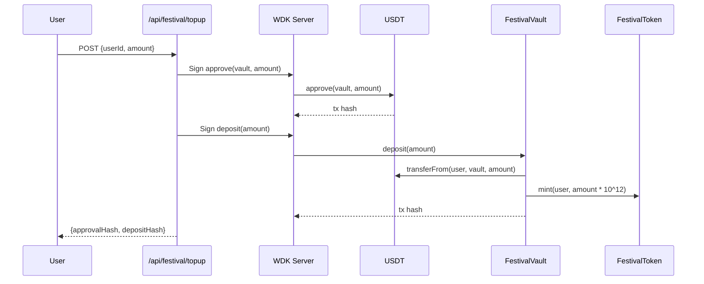
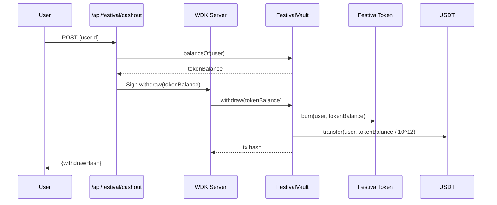

# Design Document

## Overview

Orby is a festival payment system built on Ethereum Sepolia that implements a Vault-based Escrow Architecture. The system consists of three main layers:

1. **Frontend Layer**: Next.js 15 application with Tether WDK for client-side wallet management
2. **API Layer**: Next.js Route Handlers that orchestrate blockchain transactions using WDK and Viem
3. **Smart Contract Layer**: Solidity contracts (FestivalFactory, FestivalToken, FestivalVault) deployed on Sepolia

The core invariant is **1:1 USDT backing**: every Festival Token in circulation is backed by exactly one USDT locked in the Vault.

## Architecture

```mermaid
graph TB
    subgraph Frontend["Frontend (Next.js 15)"]
        LP[Login Page]
        WP[Wallet Page]
        AP[Admin Page]
        WDK_C[WDK Client]
    end

    subgraph API["API Layer"]
        JOIN[/api/festival/join]
        TOPUP[/api/festival/topup]
        CASHOUT[/api/festival/cashout]
        CREATE[/api/admin/create-festival]
        WDK_S[WDK Server]
    end

    subgraph Blockchain["Ethereum Sepolia"]
        USDT[USDT Contract]
        FF[FestivalFactory]
        FT[FestivalToken]
        FV[FestivalVault]
    end

    LP --> WDK_C
    WP --> TOPUP
    WP --> CASHOUT
    AP --> CREATE

    TOPUP --> WDK_S
    CASHOUT --> WDK_S
    CREATE --> WDK_S

    WDK_S --> USDT
    WDK_S --> FF
    FF --> FT
    FF --> FV
    FV --> FT
    FV --> USDT
```

### Transaction Flow: Deposit



### Transaction Flow: Withdrawal



## Components and Interfaces

### 1. WDK Client (`apps/web/lib/wdk/client.ts`)

Client-side wallet manager for user authentication and address derivation using Tether WDK.

```typescript
import WDK from '@tetherto/wdk';
import WalletManagerEvm from '@tetherto/wdk-wallet-evm';

const SEPOLIA_CONFIG = {
  chainId: 11155111,
  rpcUrl: process.env.NEXT_PUBLIC_SEPOLIA_RPC_URL || 'https://rpc.sepolia.org',
};

const STORAGE_KEY = 'orby_seed';

// Singleton WDK instance
let wdkInstance: WDK | null = null;

export const wdkClient = {
  // Create new wallet - generates BIP-39 mnemonic using WDK.getRandomSeedPhrase()
  createWallet(): string {
    const seedPhrase = WDK.getRandomSeedPhrase();
    localStorage.setItem(STORAGE_KEY, seedPhrase);
    return seedPhrase;
  },
  
  // Check if wallet seed exists in localStorage
  hasWallet(): boolean {
    return typeof window !== 'undefined' && !!localStorage.getItem(STORAGE_KEY);
  },
  
  // Login - initialize WDK with stored mnemonic and register EVM wallet
  async login(): Promise<void> {
    const seedPhrase = localStorage.getItem(STORAGE_KEY);
    if (!seedPhrase) throw new Error('No seed phrase found');
    
    wdkInstance = new WDK(seedPhrase)
      .registerWallet('ethereum', WalletManagerEvm, {
        provider: SEPOLIA_CONFIG.rpcUrl,
      });
  },
  
  // Get account for index using WDK's getAccount method
  async getAccount(index: number = 0) {
    if (!wdkInstance) throw new Error('WDK not initialized');
    return wdkInstance.getAccount('ethereum', index);
  },
  
  // Get address for account index
  async getAddress(index: number = 0): Promise<string> {
    const account = await this.getAccount(index);
    return account.getAddress();
  },
  
  // Get balance for account index
  async getBalance(index: number = 0): Promise<bigint> {
    const account = await this.getAccount(index);
    return account.getBalance();
  },
  
  // Check if WDK is initialized
  isInitialized(): boolean {
    return wdkInstance !== null;
  },
};
```

### 2. WDK Server (`apps/web/lib/wdk/server.ts`)

Server-side wallet manager for signing and broadcasting transactions using Tether WDK.

```typescript
import WDK from '@tetherto/wdk';
import WalletManagerEvm from '@tetherto/wdk-wallet-evm';
import { type Address, type Hash } from 'viem';

const SEPOLIA_CONFIG = {
  chainId: 11155111,
  rpcUrl: process.env.SEPOLIA_RPC_URL || 'https://rpc.sepolia.org',
};

// Server-side WDK instance (initialized from environment mnemonic)
let serverWdk: WDK | null = null;

export const wdkServer = {
  // Initialize WDK with mnemonic from environment variable
  async init(): Promise<void> {
    const seedPhrase = process.env.WDK_SEED_PHRASE;
    if (!seedPhrase) throw new Error('WDK_SEED_PHRASE not set');
    
    serverWdk = new WDK(seedPhrase)
      .registerWallet('ethereum', WalletManagerEvm, {
        provider: SEPOLIA_CONFIG.rpcUrl,
      });
  },
  
  // Get account for index (0 = admin, 1 = demo user)
  async getAccount(index: number) {
    if (!serverWdk) await this.init();
    return serverWdk!.getAccount('ethereum', index);
  },
  
  // Get address for account index
  async getAddress(index: number): Promise<string> {
    const account = await this.getAccount(index);
    return account.getAddress();
  },
  
  // Send transaction using WDK account
  async sendTransaction(params: {
    accountIndex: number;
    to: Address;
    value?: bigint;
    data?: string;
  }): Promise<{ hash: Hash }> {
    const account = await this.getAccount(params.accountIndex);
    return account.sendTransaction({
      to: params.to,
      value: params.value || 0n,
      data: params.data,
    });
  },
  
  // Get balance for account
  async getBalance(index: number): Promise<bigint> {
    const account = await this.getAccount(index);
    return account.getBalance();
  },
};
```

### 3. Smart Contracts

#### FestivalToken.sol
```solidity
interface IFestivalToken {
    function mint(address to, uint256 amount) external; // onlyOwner
    function burn(address from, uint256 amount) external; // onlyOwner
    // Standard ERC20 functions inherited from OpenZeppelin
}
```

#### FestivalVault.sol
```solidity
interface IFestivalVault {
    // State
    function usdt() external view returns (address);
    function token() external view returns (address);
    function festivalStart() external view returns (uint256);
    function festivalEnd() external view returns (uint256);
    function redemptionOpen() external view returns (bool);
    function escrowedUSDT(address user) external view returns (uint256);
    
    // User functions
    function deposit(uint256 usdtAmount) external;
    function withdraw(uint256 tokenAmount) external;
    
    // Admin functions
    function setRedemptionOpen(bool open) external; // onlyOwner
}
```

#### FestivalFactory.sol
```solidity
interface IFestivalFactory {
    event FestivalCreated(
        address indexed token,
        address indexed vault,
        string name,
        string symbol
    );
    
    function usdt() external view returns (address);
    function createFestival(
        string calldata name,
        string calldata symbol,
        uint256 startTime,
        uint256 endTime
    ) external returns (address token, address vault);
}
```

### 4. API Routes

#### POST /api/festival/topup
```typescript
interface TopupRequest {
  userId: string;
  amount: number; // USDT amount (human readable)
}

interface TopupResponse {
  success: boolean;
  approvalHash: string;
  depositHash: string;
}
```

#### POST /api/festival/cashout
```typescript
interface CashoutRequest {
  userId: string;
}

interface CashoutResponse {
  success: boolean;
  withdrawHash: string;
  usdtReturned: string;
}
```

#### POST /api/admin/create-festival
```typescript
interface CreateFestivalRequest {
  festivalName: string;
  festivalSymbol: string;
  startTime?: number; // Unix timestamp, defaults to now
  endTime?: number;   // Unix timestamp, defaults to now + 3 days
}

interface CreateFestivalResponse {
  name: string;
  symbol: string;
  tokenAddress: string;
  vaultAddress: string;
  ownerAddress: string;
}
```

## Data Models

### Festival Configuration
```typescript
interface FestivalConfig {
  name: string;
  symbol: string;
  tokenAddress: Address;
  vaultAddress: Address;
  ownerAddress: Address;
  factoryAddress: Address;
  startTime: number;
  endTime: number;
  redemptionOpen: boolean;
}
```

### User Balance (On-Chain)
```typescript
interface OnChainBalance {
  usdt: bigint;           // 6 decimals
  festivalTokens: bigint; // 18 decimals
  escrowedUSDT: bigint;   // 6 decimals (locked in vault)
}
```

### Session Data
```typescript
interface SessionData {
  userId: string;
  address: Address;
  accountIndex: number;
}
```


## Correctness Properties

*A property is a characteristic or behavior that should hold true across all valid executions of a system-essentially, a formal statement about what the system should do. Properties serve as the bridge between human-readable specifications and machine-verifiable correctness guarantees.*

### Property 1: Wallet Creation and Detection Consistency

*For any* call to createWallet(), the system SHALL store a valid BIP-39 mnemonic in localStorage, and subsequent calls to hasWallet() SHALL return true.

**Validates: Requirements 1.1, 1.3**

### Property 2: Login Initializes Wallet from Stored Seed

*For any* valid BIP-39 mnemonic stored in localStorage under 'orby_seed', calling login() SHALL successfully initialize the WDK wallet manager and derive a valid Ethereum address.

**Validates: Requirements 1.2**

### Property 3: Factory Deployment Creates Valid Contract Pair

*For any* valid festival parameters (name, symbol, startTime, endTime), calling FestivalFactory.createFestival() SHALL:
- Deploy a FestivalToken contract with the specified name and symbol
- Deploy a FestivalVault contract linked to the token
- Transfer token ownership to the vault
- Emit a FestivalCreated event with the correct addresses

**Validates: Requirements 2.1, 2.3, 2.4**

### Property 4: Token Mint/Burn Access Control

*For any* address that is not the FestivalToken owner, calling mint() or burn() SHALL revert with an access control error.

**Validates: Requirements 2.2**

### Property 5: Deposit Mints Tokens at Correct Ratio

*For any* USDT deposit amount, the FestivalVault.deposit() function SHALL:
- Transfer exactly `amount` USDT (6 decimals) from user to vault
- Mint exactly `amount * 10^12` Festival Tokens (18 decimals) to user
- Increase user's escrowedUSDT by `amount`

**Validates: Requirements 3.1, 3.2**

### Property 6: Withdrawal Burns Tokens and Returns USDT

*For any* token withdrawal amount where redemption is allowed, the FestivalVault.withdraw() function SHALL:
- Burn exactly `amount` Festival Tokens from user
- Transfer exactly `amount / 10^12` USDT to user
- Decrease user's escrowedUSDT by `amount / 10^12`

**Validates: Requirements 4.1**

### Property 7: Withdrawal Requires Redemption Open or Festival Ended

*For any* withdrawal attempt where redemptionOpen is false AND block.timestamp < festivalEnd, the FestivalVault.withdraw() function SHALL revert.

**Validates: Requirements 4.2**

### Property 8: Withdrawal Limited by Escrowed Balance

*For any* withdrawal attempt where the requested USDT equivalent exceeds the user's escrowedUSDT balance, the FestivalVault.withdraw() function SHALL revert.

**Validates: Requirements 4.3**

### Property 9: Cashout Withdraws Full Token Balance

*For any* user with a non-zero token balance, calling the cashout API SHALL result in the user's token balance becoming zero and their USDT balance increasing by the equivalent amount.

**Validates: Requirements 4.4**

### Property 10: Redemption Status Toggle

*For any* boolean value passed to setRedemptionOpen(), the vault's redemptionOpen state SHALL equal that value after the transaction.

**Validates: Requirements 4.5**

### Property 11: Escrow Invariant (1:1 Backing)

*For any* state of the system, the Vault's USDT balance multiplied by 10^12 SHALL equal the FestivalToken's total supply. This ensures every token is backed 1:1 by USDT.

**Validates: Requirements 8.2**

## Error Handling

### Smart Contract Errors

| Error | Condition | Contract |
|-------|-----------|----------|
| `InsufficientBalance` | User tries to withdraw more than escrowed | FestivalVault |
| `RedemptionNotOpen` | Withdrawal attempted before redemption opens | FestivalVault |
| `InvalidAmount` | Zero amount passed to deposit/withdraw | FestivalVault |
| `TransferFailed` | USDT transfer fails | FestivalVault |
| `OwnableUnauthorizedAccount` | Non-owner calls restricted function | FestivalToken |

### API Errors

| Status | Error | Condition |
|--------|-------|-----------|
| 400 | `INVALID_AMOUNT` | Amount <= 0 or not a number |
| 400 | `INSUFFICIENT_BALANCE` | User lacks USDT for deposit |
| 401 | `UNAUTHORIZED` | Invalid session or userId |
| 500 | `TX_FAILED` | Blockchain transaction reverted |
| 500 | `WALLET_ERROR` | WDK initialization failed |

### Client-Side Errors

| Error | Handling |
|-------|----------|
| No seed in localStorage | Redirect to /login |
| WDK initialization failure | Show error toast, retry option |
| Network error | Show offline indicator, queue retry |

## Testing Strategy

### Property-Based Testing Framework

The project will use **fast-check** for property-based testing in TypeScript. Each correctness property will be implemented as a property-based test with a minimum of 100 iterations.

### Test Categories

#### 1. Smart Contract Tests (Hardhat + Chai)

Unit tests for contract functions:
- FestivalToken: mint, burn, transfer, access control
- FestivalVault: deposit, withdraw, escrow tracking, redemption gating
- FestivalFactory: createFestival, event emission

Property-based tests for contract invariants:
- Escrow invariant (Property 11)
- Deposit/withdrawal ratio (Properties 5, 6)
- Access control (Property 4)

#### 2. WDK Integration Tests

- Wallet creation generates valid mnemonic (Property 1)
- Login with stored seed (Property 2)
- Address derivation consistency

#### 3. API Integration Tests

- Topup flow: approval + deposit transactions
- Cashout flow: full balance withdrawal (Property 9)
- Error handling for invalid inputs

### Test Annotations

Each property-based test MUST include a comment referencing the correctness property:

```typescript
// **Feature: ethereum-sepolia-wallet, Property 5: Deposit Mints Tokens at Correct Ratio**
test.prop([fc.integer({ min: 1, max: 1000000 })])('deposit mints correct token amount', (amount) => {
  // Test implementation
});
```

### Test Configuration

```typescript
// fast-check configuration
const fcConfig = {
  numRuns: 100,
  verbose: true,
  seed: Date.now(),
};
```

### Coverage Requirements

- All correctness properties must have corresponding property-based tests
- Smart contract functions must have >90% line coverage
- API routes must have integration tests for success and error paths
